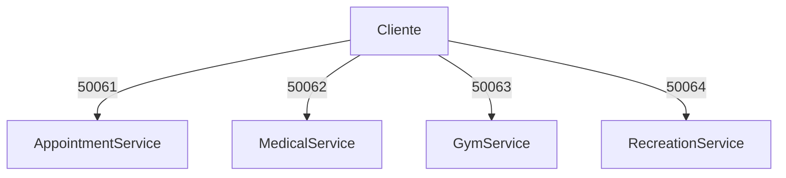

# Reflexión - Parte V (Microservicios)

## Diagrama de microservicios

**1. ¿Por qué decidiste separar esos servicios y no otros?**
Se separaron de acuerdo con sus diferentes dominios de negocio (Citas de bienestar, Recursos Recreativos, y Gimnasio). Cada uno maneja un tipo distinto de recurso y reglas, lo cual permite escalarlos y mantenerlos de forma independiente (si el Gimnasio colapsa por muchas reservas, las citas médicas no se verán afectadas).

**2. ¿Qué datos pertenecen exclusivamente a cada servicio?**
- `AppointmentService`: Citas y turnos de los estudiantes, estado de las citas (solicitado/cancelado/atendido).
- `MedicalService`: Especialidades ofrecidas (Medicina, Odontología) y disponibilidad de cupos en cada una.
- `GymService`: Franjas horarias y sesiones de cada estudiante.
- `RecreationService`: Inventario de recursos físicos (Canchas, Juegos) y su estado (disponible/reservado).

**3. ¿Qué riesgo aparece cuando el cliente conoce todos los servicios directamente?**
Si el cliente habla con todos los microservicios, el cliente se acopla a las IPs y puertos de cada uno. Si el backend cambia, se divide un servicio o cambia de dirección, el cliente tiene que actualizarse. También la comunicación puede volverse ineficiente si el cliente necesita recolectar datos de 4 servicios (4 peticiones de red separadas) en lugar de hacer una sola a un Gateway (API Gateway pattern) que agregue la respuesta.
