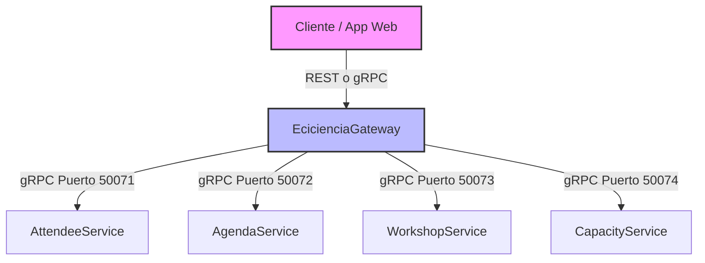

# ECICIENCIA - Arquitectura de Plataforma

## Diagrama de Arquitectura

## Servicios y Responsabilidades

| Servicio | Responsabilidad |
|----------|----------------|
| **`AttendeeService`** | Registro de nuevos asistentes, validación de credenciales y consulta de perfiles de usuarios. |
| **`AgendaService`** | Gestión del cronograma, actividades, recintos, horarios y exposición de las franjas. |
| **`WorkshopService`** | Manejo de las lógicas específicas de talleres interactivos (lista de espera, pre-requisitos, cancelaciones). |
| **`CapacityService`** | Servicio core crítico que controla el aforo físico de cada recinto en tiempo real (maneja concurrencia fuerte). |

## Operaciones del API Gateway (EcicienciaGateway)

El Gateway es la única cara visible para las Apps Web o móviles. Expone las siguientes operaciones agregando las respuestas de los microservicios subyacentes:

- `registerForWorkshop(attendeeId, workshopId)`: Orquesta una llamada a `CapacityService` para verificar cupos. Si hay cupo, llama a `WorkshopService` para apartarlo, y notifica a `AttendeeService` sobre el registro.
- `getAgenda(date)`: Llama a `AgendaService` para obtener todas las actividades del día.
- `checkCapacity(activityId)`: Consulta a `CapacityService` cuántos cupos quedan para una actividad (útil para indicadores en tiempo real de "Casi lleno").
- `getActivitiesByTimeSlot(date, timeSlot)`: Filtra en el `AgendaService` las opciones de actividades concurrentes en una hora específica.
